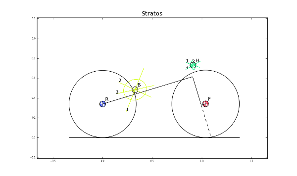
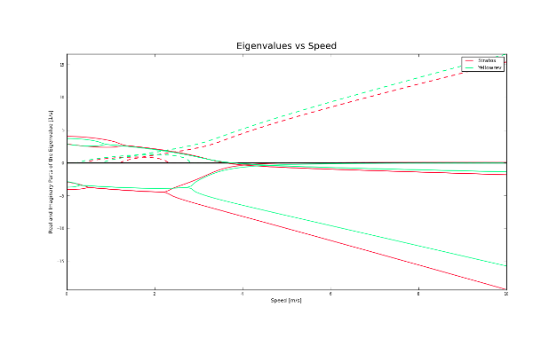
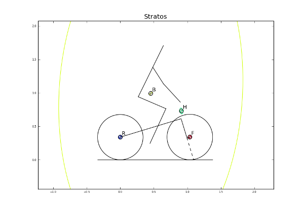
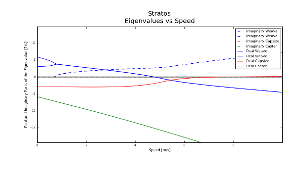
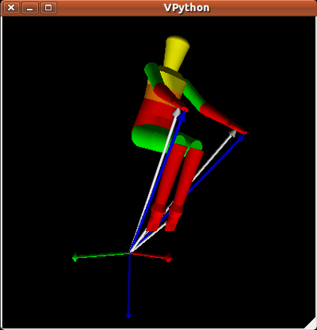

.. _usage:

=============
Example Usage
=============

The Data
========
The program requires input data in the form of basic text files and a
particular file system directory structure to organize the data. To use the
program you will need to navigate to a directory where you have at least one
directory named for a bicycle that contains parameters files or raw data
measurements. Refer to the document :ref:`data-file` for details about what the
data files should contain.

Data Directory
--------------

You will need to setup a directory (a directory named ``data`` is used in the
following examples) somewhere for the data input and output files. The
structure of the directory should look like this::

    /data
    |
    -->/bicycles
    |  |
    |  -->/Bicyclea
    |  |  |
    |  |  -->/Parameters
    |  |  |
    |  |  -->/Photos
    |  |  |
    |  |  -->/RawData
    |  |
    |  -->/Bicycleb
    |     |
    |     -->/Parameters
    |     |
    |     -->/Photos
    |     |
    |     -->/RawData
    -->/riders
       |
       -->/Ridera
          |
          -->/Parameters
          |
          -->/RawData

Bicycle/rider name
------------------
A bicycle or rider name is a descriptive word (or compound word) for a bicycle or
rider in which the first letter is capitalized. Examples of bicycle short names
include ``Bianchipista``, ``Bike``, ``Mybike``, ``Rigidrider``,
``Schwintandem``, ``Gyrobike``, ``Bicyclea``, etc. Examples of rider names
include ``Jason``, ``Mont``, ``Lukepeterson``, etc. The program relies on
CamelCase words, so make sure the first letter is capitalized and no others
are.

bicycles Directory
------------------
The ``bicycles`` directory contains subdirectories for each bicycle. The
directory name for a bicycle should be its bicycle name. Each directory in
``bicycles`` should contain at least a ``RawData`` directory or a ``Parameters``
directory. ``Photos`` is an optional directory.

RawData directory
~~~~~~~~~~~~~~~~~
You can supply raw measurement data in two forms:

 1. A file containing all the manual measurements (including the oscillation
    periods for each rigid body). Refer to :ref:`bicycle-measured-input` for
    details about the contents of this file.
 2. A file containing all the manual measurements (not including the
    oscillation periods for each rigid body) and a set of data files
    containing oscillatory signals from which the periods can be
    estimated. Refer to :ref:`pendulum-input` for details about these files.

The manual measurement data file should follow the naming convention ``<bicycle
name>Measure.txt``. This data is used to generate parameter files that can be
saved to the ``Parameters`` directory.

Parameters directory
~~~~~~~~~~~~~~~~~~~~
If you don't have any raw measurements for the bicycle it is also an option to
supply a parameter file in the ``Parameters`` directory. Simply add a file named
``<bicycle name>Benchmark.txt`` with the benchmark parameter set into the
``Parameters`` directory for the particular bicycle. Refer to
:ref:`bicycle-parameter-input` for details about the contents of the file.

Photos directory
~~~~~~~~~~~~~~~~
The ``Photos`` folder should contain photos of the bicycle parts hung as the
various pendulums in the various orientations. The filename should follow the
conventions of the raw signal data files.

riders directory
----------------
The riders directory should contain a directory for each rider that you have
data for. The individual rider directory contains a ``Parameters`` for the
rider inertial parameters sets and a ``RawData`` directory for the raw
measurements needed for the Yeadon inertia model. Refer to :ref:`rider-input`
for details about these input files.

Example Data
------------
Example data is available as a `bz2 tarball`_ or a `zip file`_ [~90mb].

.. _bz2 tarball: http://biosport.ucdavis.edu/research-projects/bicycle/bicycle-parameter-measurement/bicycleparameters-data.tar.bz2

.. _zip file: http://biosport.ucdavis.edu/research-projects/bicycle/bicycle-parameter-measurement/bicycleparameters-data.zip

Loading bicycle data
====================
The easiest way to load a bicycle is::

  >>> import bicycleparameters as bp
  >>> bicycle = bp.Bicycle('Stratos')

This will create an instance of the Bicycle class in the variable bicycle based
off of input data from the ``./bicycles/Stratos/`` directory. The program first
looks to see if there are any parameter sets in
``./bicycles/Stratos/Parameters/``. If so, it loads the data, if not it looks
for ``./bicycles/Stratos/RawData/StratosMeasurments.txt`` so that it can
generate the parameter set. The raw measurement file may or may not contain the
oscillation period data for the bicycle moment of inertia caluclations. If it
doesn't then the program will look for the series of ``.mat`` files need to
calculate the periods. If no data is there, then you get an error.

There are other loading options::

  >>> bicycle = bp.Bicycle('Stratos', pathToData='<some path to the data directory>', forceRawCalc=True, forcePeriodCalc=True)

The ``pathToData`` option allows you specify a directory other than the current
directory as your data directory. The ``forceRawCalc`` forces the program to
load ``./bicycles/Stratos/RawData/StratosMeasurments.txt`` and recalculate the
parameters regarless if there are any parameter files available in
``./bicycles/Stratos/Parameters/``. The ``forcePeriodCalc`` option forces the period
calcluation from the ``.mat`` files regardless if they already exist in the raw
measurement file.

Exploring bicycle parameter data
================================

The bicycle has a name::

  >>> bicycle.bicycleName
  'Stratos'

and a directory where its data is stored::

  >>> bicycle.direcotory
  './bicycles/Stratos'

The benchmark bicycle parameters are the fundamental parameter set that is used
behind the scenes for calculations. To access them type::

  >>> bPar = bicycle.parameters['Benchmark']
  >>> bPar['xB']
  0.32631503794489763+/-0.0032538862692938642

The program automatically calculates the uncertainties in the parameters based
on the raw measurements or the uncertainties provided in the parameter files.
If you'd like to work with the pure values you can remove them::

  >>> bParPure = bp.io.remove_uncertainties(bPar)
  >>> bParPure['xB']
  0.32631503794489763

That goes the same for all values with uncertainties. Check out the
`uncertainties <http://packages.python.org/uncertainties>`_ package details for
more ways to manipulate the quantities.

If the bicycle was calculated from raw data measurements you can access them
by::

  >>> bicycle.parameters['Measurements']

All parameter sets are stored in the parameter dictionary of the bicycle
instance.

To modify a parameter type::

  >>> bicycle.parameters['Benchmark']['mB] = 50.

You can regenerate the parameter sets from the raw data stored in the bicycle's
directory by calling::

  >>> bicycle.calculate_from_measured()

Basic Analysis
==============
The program has some basic bicycle analysis tools based on the Whipple bicycle
model which has been linearized about the upright configuration.

The canonical matrices for the equations of motion can be computed::

  >>> M, C1, K0, K2 = bicycle.canonical()
  >>> M
  array([[4.87735569387+/-0.0239343413077, 0.407911475492+/-0.00852495589396],
        [0.407911475492+/-0.00852495589396,
         0.203245633856+/-0.00235820505536]], dtype=object)
  >>> C1
  array([[0.0, 4.85200252888+/-0.0242948940194],
        [-0.488808930325+/-0.00358710467251,
         0.751423298199+/-0.0118190412791]], dtype=object)
  >>> K0
  array([[-8.1786550655+/-0.0281976329402,
          -0.709791925937+/-0.013158888468],
         [-0.709791925937+/-0.013158888468,
          -0.206338069868+/-0.00571395841832]], dtype=object)
  >>> K2
  array([[0.0,
          8.39212115462+/-0.0313979563061],
         [0.0,
          0.778591689057+/-0.0128042478172]], dtype=object))

as well as the state and input matrices for state space form at a particular
speed::

  >>> A, B = bicycle.state_space(1.34)
  >>> A
  array([[-0.323894489886+/-0.00578005141184,
          -1.10401174487+/-0.00684136323415, 16.324961319+/-0.039204516678,
          -2.30677907291+/-0.00824125009025],
         [3.8727732103+/-0.0342265538607, -2.73840155487+/-0.0133666010323,
          1.49533216875+/-0.153839831788, 7.71036924174+/-0.170699435465],
         [1.0, 0.0, 0.0, 0.0],
         [0.0, 1.0, 0.0, 0.0]], dtype=object)
  >>> B
  array([[0.246385378456+/-0.00169761878443,
          -0.494492409794+/-0.00770906162244],
         [-0.494492409794+/-0.00770906162244, 5.91259504914+/-0.0401866728435],
         [0.0, 0.0],
         [0.0, 0.0]], dtype=object)

You can calculate the eigenvalues and eigenvectors at any speed by calling::

   >>> w, v = bicycle.eig(4.28) # the speed should be in meters/second
   >>> w # eigenvalues
   array([[-6.83490195+0.j        ,  0.46085314+2.77336727j,
            0.46085314-2.77336727j, -1.58257375+0.j        ]])
   >>> v # eigenvectors
   array([[[ 0.04283049+0.j        ,  0.50596715+0.33334818j,
             0.50596715-0.33334818j,  0.55478588+0.j        ],
           [ 0.98853840+0.j        ,  0.72150298+0.j        ,
             0.72150298+0.j        ,  0.63786241+0.j        ],
           [-0.00626644+0.j        ,  0.14646768-0.15809917j,
             0.14646768+0.15809917j, -0.35055926+0.j        ],
           [-0.14463096+0.j        ,  0.04206844-0.25316359j,
             0.04206844+0.25316359j, -0.40305383+0.j        ]]])

The ``eig`` function also accepts a one dimensional array of speeds and returns
eigenvalues for all speeds. Note that uncertainty propagation into the
eigenvalue calculations is not supported yet.

The moment of inertia of the steer assembly (handlebar, fork and/or front
wheel) can be computed either about the center of mass or a point on the steer
axis, both with reference to a frame aligned with the steer axis::

  >>> bicycle.steer_assembly_moment_of_inertia(aboutSteerAxis=True)
  array([[0.539931205836+/-0.00362870864185, 0.0,
          0.00921422347873+/-0.00191753741975],
         [0.0, 0.578940852064+/-0.00311525776442, 0.0],
         [0.00921422347873+/-0.00191753741975, 0.0,
          0.143206097868+/-0.00100279291208]], dtype=object)

Plots
-----
You can plot the geometry of the bicycle and include the mass centers of the
various bodies, the inertia ellipsoids and the torsional pendulum axes from the
raw measurement data::

  >>> bicycle.plot_bicycle_geometry()

For visualization of the linear analysis you can plot the root loci of the
real and imaginary parts of the eigenvalues as a function of speed::

  >>> import numpy as np
  >>> speeds = np.linspace(0., 10., num=100)
  >>> bicycle.plot_eigenvalues_vs_speed(speeds)

.. image:: eigenvaluesVsSpeed.png

You can also compare the eigenvalues of two or more bicycles::

  >>> yellowrev = bp.Bicycle('Yellowrev')
  >>> bp.plot_eigenvalues([bicycle, yellowrev], speeds)

Rigid Rider
===========
The program also allows one to add the inertial affects of a rigid rider to
the Whipple bicycle system.

Rider Data
----------
You can provide rider data in one of two ways, much in the same way as the
bicycle. If you have the inertial parameters of a rider, e.g. Jason, simply add
a file into the ``./riders/Jason/Parameters/`` directory. Or if you have raw
measurements of the rider add the two files to ``./riders/Jason/RawData/``. The
`yeadon documentation`_ explains how to collect the data for a rider.

.. _yeadon documentation: http://packages.python.org/yeadon

Adding a Rider
--------------
To add a rider key in::

  >>> bicycle.add_rider('Jason')

The program first looks for a parameter for for Jason sitting on the Stratos
and if it can't find one, it looks for the raw data for Jason and computes the
inertial parameters. You can force calculation from raw data with::

  >>> bicycle.add_rider('Jason', reCalc=True)

Exploring the rider
-------------------
The bicycle has a few new attributes now that it has a rider::

  >>> bicycle.hasRider
  True
  >>> bicycle.riderName
  'Jason'
  >>> bicycle.riderPar # inertial parmeters of the rider
  {'Benchmark': {'IBxx': 7.8188533619237681,
                 'IBxz': -0.035425693766513083,
                 'IByy': 8.2729669089020437,
                 'IBzz': 2.354736583109867,
                 'mB': 79.152920866435153,
                 'xB': 0.46614935153554904,
                 'yB': 2.1457815736317352e-07,
                 'zB': -1.0385521459829261}}
  >>> bicycle.human # this is a yeadon.human object representing the Jason
  <yeadon.human.human instance at 0x2b19dd0>

The bicycle parameters now reflect that a rigid rider has been added to the
bicycle frame::

  >>> bicycle.parameters['Benchmark']['mB']
  86.37292086643515+/-0.02

At this point, the uncertainties don't necessarily offer much information for
any of the parameters that are functions of the rider, because we do not have a
good idea of the uncertainty in the human inertia calculations in the Yeadon
method.

Analysis
--------
The same linear analysis can be performed now that a rider has been added,
albeit the reported values and graphs will reflect the fact that the bicycle
frame has the added inertial effects of the rider.

Plots
-----
The bicycle geometry plot now reflects that there is a rider on the bicycle and
displays a simplified depiction::

  >>> bicycle.plot_bicycle_geometry()

The eigenvalue plot also relfects the changes::

  >>> bicycle.plot_eigenvalues_vs_speed(speeds)

Rider Visualization
-------------------
If you have the optional dependency, visual python, for yeadon installed then
you can output a three dimensional picture of the Yeadon model configured to be
seated on the bicycle. This is a bit buggy due to the nature of visual python,
but is useful none-the-less.::

  >>> bicycle.add_rider('Jason', draw=True)

